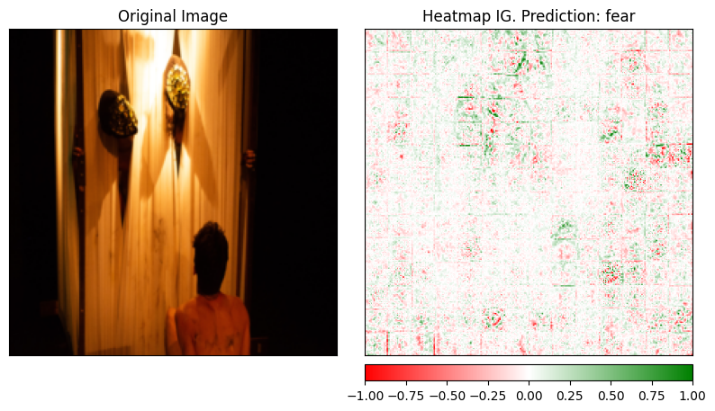
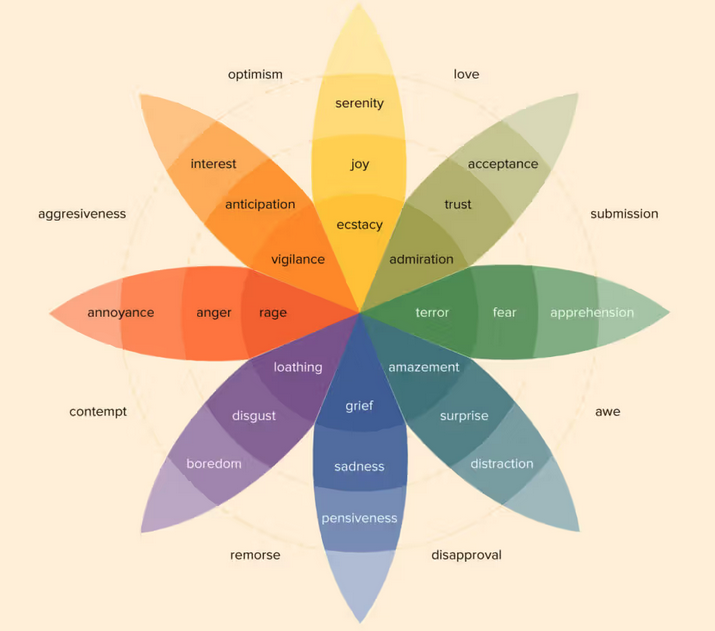
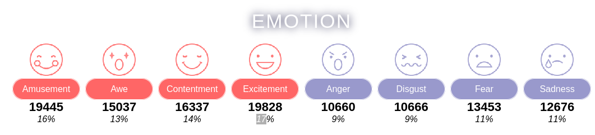

## Feeling Your Images: Visual Emotion Recognition based on Image Attributes.
### Matias Lessa Vaz

### Objective:
Our primary goal is to move beyond conventional approaches that predominantly focus on facial features.
Instead, we aim to develop a robust system that comprehensively understands the visual context of an entire image, offering a nuanced interpretation of the scene.

### Background:
Computer vision, a subfield of artificial intelligence, has witnessed remarkable progress in recent years.
However, existing models often fall short when it comes to understanding the broader context of visual information.
Our project addresses this limitation by leveraging the capabilities of Transformer classifiers.

### Transformer Classifiers:
The Transformer architecture, originally proposed for natural language processing, has demonstrated unparalleled success in capturing long-range dependencies.
We apply this architecture to the domain of computer vision, employing self-attention mechanisms to enable our model to consider global relationships within an image.

### Key Features:

    1. Holistic Image Understanding: Our model surpasses traditional facial-centric approaches, considering the entire image for a more comprehensive analysis.

    2. Adaptability: The Transformer's self-attention mechanism allows our model to adapt dynamically to different visual contexts, enhancing its versatility across various scenes.

    3. Robustness: By considering the entire image, our model proves to be more resilient to occlusions, variations in lighting, and other challenges that may confound traditional classifiers.

### Methodology:

    0. Dataset and Pretrained model: We used as based  EmoSet (https://vcc.tech/EmoSet) with images labeled for feelings (based on Plutchik’s Wheel of Emotions) to fine tunning the pretrained model made by Google (https://huggingface.co/google/vit-base-patch16-224) as base of our project.
    
    1. Data Processing: We carefully process the dataset to fits on model requirements, based on the research. 
    
    2. Train and hyper parameter tunning: We train our model. We choose the hyper parameters based on Population-based Training algorithm (ray tune python library). 
    
    3. Evalutation: It's evaluate the final results using reserved part of the dataset. The two used metrics are a confusion matrix and accuracy. 
    
    4. The visual final product: A movie with captions for the predict labels.

### Vision Transformer (ViT) Components:​

    1. Input Image:​

    The input to the model is a standard image (e.g., a photograph).​

    2. Patch + Position Embedding:​

    The image is divided into fixed-size patches (e.g., 16x16 pixels each).​

    These patches are then flattened into a one-dimensional vector (hence the term "flattened patches").​

    Each flattened patch is then passed through a linear projection to convert it into a size compatible with the transformer encoder. This is effectively a learned embedding that maps the pixel intensities to a higher-dimensional space.​

    Positional embeddings are added to the flattened patches to retain the positional information. Since the transformer architecture does not inherently process sequential data, unlike RNNs, positional embeddings are crucial for maintaining the order of the patches.​

    An extra learnable embedding, often referred to as the "class token" ([class]), is prepended to the sequence of embedded patches. The state of this class token at the output of the transformer encoder will serve as the representation of the image.​

    3. Transformer Encoder:​

    The sequence of embedded patches, along with the class token, is fed into the transformer encoder.​

    The transformer encoder consists of a stack of identical layers (Lx indicates L layers stacked). Each layer has two main components:​

        1. Multi-Head Attention: This module allows the model to weigh different parts of the image patches differently, effectively allowing the model to "attend" to certain parts of the image more when making predictions. The multi-head part means that the attention mechanism is applied in parallel multiple times with different learned weights, allowing the model to capture different types of dependencies in the data.​

        2. MLP (Multi-Layer Perceptron): After attention has been applied, the result goes through a feedforward neural network (MLP), which further processes the information.​

    Each of these components is followed by normalization (Norm), which helps in stabilizing the learning process. Additionally, there are residual connections (depicted by the + signs) around each of the main components, which help in avoiding the vanishing gradient problem by allowing gradients to flow through the network.​

    4. MLP Head:​

    The state of the class token at the output of the transformer encoder is then passed through an MLP head. This MLP head is typically a smaller network that maps the representation to the final output space.​

    For classification tasks, this MLP head will have as many outputs as there are classes, and it typically uses a softmax function to turn the logits into probabilities.​

    5. Class Output:​

    The final output is a probability distribution over the classes, indicating how likely the model thinks the image belongs to each of the given classes (e.g., Bird, Ball, Car, etc.).​

# Population-Based Training (PBT) for Hyperparameter Tuning

Population-Based Training (PBT) is an advanced technique for hyperparameter tuning in machine learning, particularly useful in scenarios where training is computationally expensive, like deep learning. It's an approach that combines the ideas of evolutionary algorithms with traditional hyperparameter optimization to efficiently find optimal hyperparameters.

## Conceptual Framework

1. **Population-Based Approach**: Unlike traditional methods that optimize a single set of hyperparameters, PBT starts with a population of models, each with different hyperparameters.

2. **Training and Evaluation**: Each model in the population is trained for a set period. After this, their performance is evaluated.

3. **Evolutionary Optimization**: Based on their performance, the best-performing models are identified. The hyperparameters of these models are then used to update the less successful models in the population.

4. **Mutation and Exploration**: Along with inheriting hyperparameters from better models, the less successful models also undergo random mutations of their hyperparameters. This introduces diversity in the population, allowing exploration of the hyperparameter space.

5. **Iteration**: This process of training, evaluating, selecting, and mutating is repeated iteratively. Over time, the entire population converges towards more optimal sets of hyperparameters.

## Advantages of PBT

- **Dynamic Adaptation**: Unlike grid or random search, PBT dynamically adapts hyperparameters during training, which can lead to more efficient exploration of the hyperparameter space.

- **Resource Efficiency**: By focusing computational resources on more promising models, PBT can be more efficient compared to methods that treat each trial independently.

- **Parallelization**: PBT is inherently parallelizable, as each model in the population can be trained independently.

- **Exploration and Exploitation**: PBT naturally balances exploration (trying new hyperparameter combinations) and exploitation (refining the best combinations).

## Use Cases

- **Deep Learning**: Particularly useful in deep learning where training individual models is resource-intensive.

- **Reinforcement Learning**: Often used in reinforcement learning tasks where the environment is complex and the training is expensive.

## Challenges

- **Computational Resources**: Requires significant computational resources, as multiple models are trained simultaneously.

- **Hyperparameter Interdependence**: The interplay between hyperparameters can be complex, and PBT might require careful design to ensure efficient exploration.

## Conclusion

PBT is a powerful method for hyperparameter tuning, especially in complex and resource-intensive scenarios. Its dynamic and evolutionary nature allows for efficient exploration of hyperparameter spaces, making it a valuable tool in the arsenal of machine learning practitioners, particularly those working with deep learning and reinforcement learning models.

Paper for the file
https://arxiv.org/abs/1711.09846

# Explainable AI (XAI) for Transformers

Explainable AI (XAI) for transformer models is an important area, especially given the increasing complexity and widespread use of these models in various applications. Transformers, known for their efficiency in handling sequential data, are widely used in natural language processing (NLP) and other fields. Making these models explainable involves understanding how they make decisions or predictions, which is crucial for transparency, trustworthiness, and regulatory compliance.

## Key Concepts in Explainable AI for Transformers

1. **Attention Mechanism**: Transformers use an attention mechanism to weigh the significance of different parts of the input data. In XAI, visualizing these attention weights can provide insights into which parts of the input the model focuses on when making decisions.

2. **Feature Attribution**: This involves identifying which input features (such as words in a sentence) are most influential for the model’s predictions. Techniques like Layer-wise Relevance Propagation (LRP) or Integrated Gradients can be applied to transformers to attribute the prediction to specific input features.

3. **Model Simplification**: Simplifying the model to a more interpretable form while preserving its behavior can aid in understanding. This can involve creating surrogate models that approximate the transformer’s decision boundaries.

4. **Probing Tasks**: These are designed to test the linguistic properties that a transformer encodes. By examining how well a transformer performs on tasks like part-of-speech tagging or entity recognition, we can infer what information the model captures.

## Techniques for XAI in Transformers

1. **Attention Visualization**: By visualizing attention scores, we can see which words or tokens the model focuses on for a specific task. This is particularly useful in tasks like translation, summarization, or question answering.

2. **Gradient-Based Methods**: Techniques like Integrated Gradients or SmoothGrad can highlight input features that significantly influence the output. These methods compute the gradient of the output with respect to the input, providing a sensitivity map.

3. **Counterfactual Explanations**: Generating counterfactual examples, i.e., slightly altered inputs that lead to different predictions, can help understand the decision boundaries of the model.

4. **Layer-wise Relevance Propagation (LRP)**: This backpropagation technique decomposes the output decision to the individual input features, providing a relevance score for each feature.

## Challenges and Limitations

- **Complexity**: Transformers are inherently complex, with millions of parameters and sophisticated mechanisms like multi-head attention, making them difficult to interpret.

- **Attention is Not Explanation**: Attention weights may not always provide a causal explanation for a model’s decision. They indicate correlation rather than causation.

- **Scalability**: Some XAI techniques are computationally intensive and may not scale well with very large models.

- **Generalizability**: Techniques effective for one type of transformer model may not work as well for others.

## Conclusion

Explainable AI for transformers is about making these advanced models more transparent and understandable. While there are various techniques available, each has its strengths and limitations. The choice of technique depends on the specific model and the context of the task. As transformers continue to evolve, so too will the methods for explaining their decisions, which is crucial for responsible and ethical AI development.

### The science behind the Labels

Below, Diagram of Plutchik’s Wheel of Emotions, the theory behind of the dataset labels.

Plutchik's Wheel of Emotions is a psychological model that represents various human emotions and their relationships. Developed by Robert Plutchik, a psychologist, the wheel organizes emotions into primary, secondary, and tertiary categories based on their intensity and combinations. The wheel consists of eight primary emotions, and each primary emotion has an opposite.

Here's a breakdown of the primary emotions in Plutchik's Wheel:

    Joy - Opposite: Sadness
    Trust - Opposite: Disgust
    Fear - Opposite: Anger
    Surprise - Opposite: Anticipation
    Sadness - Opposite: Joy
    Disgust - Opposite: Trust
    Anger - Opposite: Fear
    Anticipation - Opposite: Surprise

The wheel also includes the concept of blends, where adjacent emotions can combine to form secondary emotions. For example, combining joy and trust results in love, while combining fear and surprise leads to awe.

The model is useful for understanding the complexity of human emotions and how they relate to one another. Plutchik's Wheel of Emotions can be applied in various fields, including psychology, design, and human-computer interaction, to better grasp the emotional aspects of human experiences.

The dataset labels to our training with the respective percentage for each class.

Because of the low variance of percentage between classes and the high number of samples, we decide to don't resample to uniformize the number os labels. That, together with the final results showing is harder to classify the overrepresented classes (normally, what happens is on the other way), leads us to decide to stay with all samples.